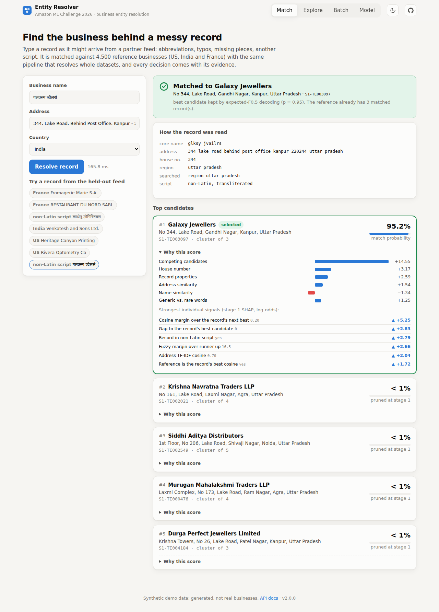
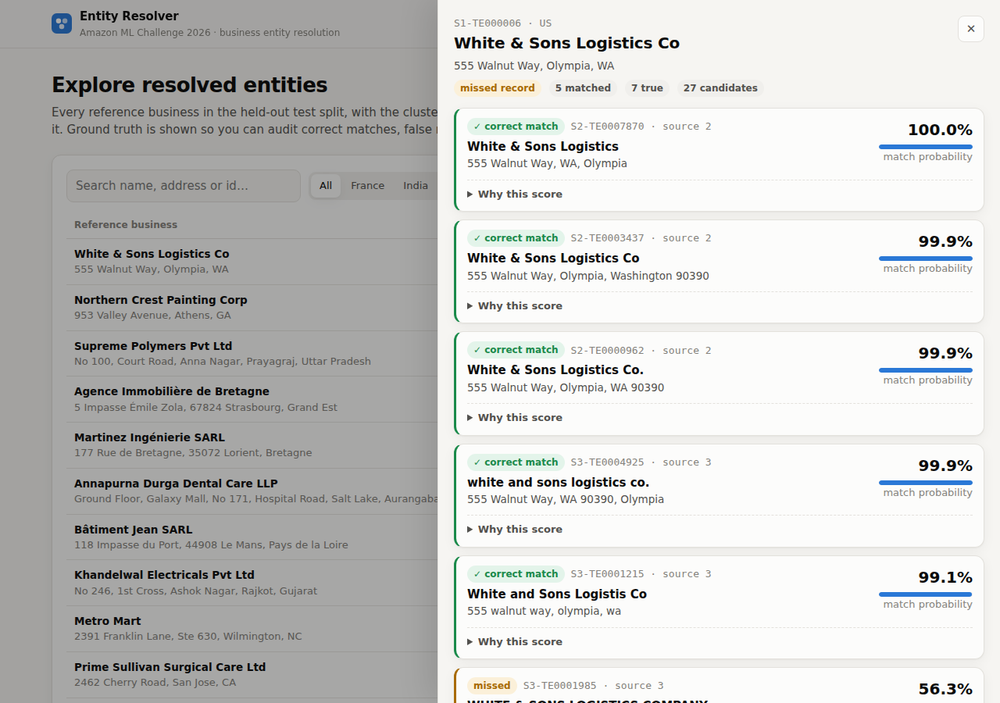
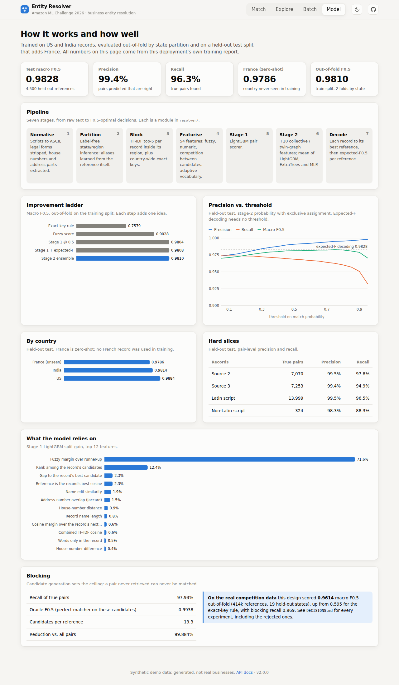

# Entity Resolver: business entity resolution across noisy sources

**Amazon ML Challenge 2026.** Business records arrive from three independent sources with no shared IDs, full of abbreviations, typos, missing fields, reordered addresses and other scripts. For every business in the reference source, find all of its records in the other two. The challenge scores it with **macro F0.5**, so a false merge costs twice as much as a miss.

This repository holds the full solution as a working product:

- **A validated ML pipeline.** Label-free partitioning, TF-IDF + exact-key blocking, 54 engineered features, a two-stage LightGBM / ExtraTrees / MLP matcher, and expected-F0.5 decoding. It scored **0.9614 macro F0.5 out-of-fold on the real competition data** (0.9655 with the later legal-form features), up from 0.595 for a rule baseline.
- **A web app and API.** Resolve a single messy record live and see *why*; audit every resolved entity against ground truth; upload whole datasets and download validated submission files; inspect the model's evaluation.
- **A synthetic data generator.** It produces data in the exact challenge format, so everything runs end to end without the (non-redistributable) competition data, including a country the model never sees in training.



## Quick start

```bash
git clone https://github.com/sakshamg251206/amazon_ml.git && cd amazon_ml
python3.12 -m venv .venv && source .venv/bin/activate
pip install -r requirements-dev.txt        # macOS: brew install libomp (LightGBM)

python -m resolver demo                    # synth data -> train -> evaluate -> index (~1 min)
python -m resolver serve                   # http://localhost:8000
```

Or with Docker, which generates the data and trains the model at build time:

```bash
docker build -t entity-resolver . && docker run -p 8000:8000 entity-resolver
```

## What you can do in the app

| Tab | What it does |
|---|---|
| **Match** | Type a record as a partner feed might send it. You see how it was normalised, which region it was routed to, the top reference candidates with match probabilities, the final decision (match or abstain), and a SHAP breakdown of the evidence (name, address, house number, competing candidates, vocabulary). ~150 ms per query. |
| **Explore** | Browse all 4,500 resolved reference businesses in the held-out split. Filter by country or by outcome (exact, false merge, missed). Open any entity to see its cluster: correct matches, false matches, misses and *where the missed record went*, each with its explanation. |
| **Batch** | Upload `source1/2/3.tsv` (plus optional ground truth). You get progress by pipeline stage, validation against the official submission rules, per-country metrics, a preview, and a zip with `matching_results.tsv` + `candidate_pairs.tsv`. One click runs the French sample. |
| **Model** | Out-of-fold improvement ladder, precision/recall vs. threshold, per-country and hard-slice results, feature importance, and blocking quality, all read from this deployment's own training report. |

| Explore | Model |
|---|---|
|  |  |

## Results

### Real competition data (from the original competition work, see `DECISIONS.md`)

Validated out-of-fold on 414k reference businesses in 19 whole held-out states, at full candidate density.

| Version | Macro F0.5 |
|---|---|
| Exact-key rule baseline | 0.5950 |
| Fuzzy score, no learning | 0.799 |
| LightGBM, 34 features | 0.9420 |
| + competition / difference features | 0.9585 |
| + adaptive generic / rare vocabulary | 0.9594 |
| + stage-2 collective ensemble, expected-F decoding | 0.9614 |
| + canonical addresses at stage 2 (E-A1) | 0.9639 |
| **Legal-form agreement, stage 1 (E-T4): final competition submission** | **0.9655** |

Blocking recall was 0.969 at 31 candidates per reference (oracle ceiling 0.990). `research/f05-gap/` holds the error audit and literature review behind each step. The product engine in `resolver/` implements the 0.9614 design; the later phase-2 features (D22–D29) live in `competition/` and are not yet ported (see D30).

### Synthetic demo data (this deployment, reproducible with `python -m resolver demo`)

- **Train:** 8,000 US + India references and 29.5k records. Evaluated out-of-fold with whole states held out.
- **Test:** a separate 4,500-reference split that **adds France, which never appears in training**.

| Step (out-of-fold, train) | F0.5 | Precision | Recall |
|---|---|---|---|
| Exact-key rule | 0.758 | 0.998 | 0.545 |
| Fuzzy score (threshold tuned on the labels) | 0.903 | 0.912 | 0.913 |
| Stage 1 LightGBM @ 0.5 | 0.980 | 0.989 | 0.969 |
| Stage 1 + expected-F decoding | 0.981 | 0.991 | 0.967 |
| Stage 2 ensemble + expected-F | 0.981 | 0.992 | 0.965 |

| Held-out test | F0.5 | Precision | Recall |
|---|---|---|---|
| All (4,500 references) | **0.983** | 0.994 | 0.963 |
| US | 0.988 | 0.996 | 0.979 |
| India | 0.981 | 0.995 | 0.959 |
| **France (zero-shot)** | **0.979** | 0.993 | 0.953 |

- Blocking recall on the test split is 0.979, at 19 candidates per reference (99.88% of all pairs pruned).
- Non-Latin-script records are the hardest slice (recall 0.88), as they were on the real data.
- The synthetic data is somewhat easier than the real data. On it, stage 2 adds little over stage 1 (+0.0002, against +0.003 on the real data).
- Training takes ~40 s on 4 CPUs.

## How it works

```
raw TSVs ─► normalise ─► partition ─► block ─► featurise ─► stage 1 ─► stage 2 ─► decode ─► matches
            scripts,     label-free   TF-IDF    54 pair     LightGBM   +10 collec-  record → best
            legal forms, state/region top-5 ∪   features               tive feats,  reference, then
            house nos.   inference    exact keys                       LGBM+ET+MLP  expected-F0.5
```

1. **Normalise** (`resolver/normalize.py`). `anyascii` transliterates every script, strips legal forms across US, India and France (LLC, Pvt Ltd, SARL…), and extracts the house number, address components and a sorted name key.
2. **Partition** (`partition.py`). Learns, without labels, which address components identify a state or region. The reference source always ends with its state, so aliases are learned from it and then expanded through co-occurrence in the other sources. This runs on the test split's own data, so France gets its own regions without any French training data.
3. **Block** (`block.py`). Within each partition: TF-IDF on character 3-grams of the name, word 1–2-grams of the address, and their combination, keeping the top 5 per record. Country-wide, five exact keys catch records whose region is missing. Each partition index is fitted on the reference only, so single-record lookups get exactly the batch cosines.
4. **Featurise** (`features.py`, `features2.py`, `adaptive.py`):
   - fuzzy name and address similarities;
   - house-number relations;
   - **competition features**: is this reference the record's best candidate, and by what margin? This was the single biggest gain on the real data;
   - **adaptive vocabulary**: generic words learned per dataset and country ("Holdings", "Développement"), which separate fake neighbour records from real copies.

   `country` is deliberately never a feature.
5. **Stage 1** is a LightGBM pair scorer.
6. **Stage 2** (`collective.py`) adds evidence from other records: how strongly they claim the same reference, and whether exact-key "twins" agree. Its input is out-of-fold stage-1 probabilities during training. The final score is a plain mean of LightGBM, ExtraTrees and an MLP.
7. **Decode** (`decode.py`). Each record goes to its single best reference, then each reference keeps the top-k records that maximise *expected* F0.5. It predicts nothing when "no match" is more likely; a singleton scores 1 only for an empty prediction.

**Single-record matching** (`index.py`) replays the same steps for one new record against the resolved dataset. It uses the same partition index and keys, competition features against the stored candidates, collective features against stored stage-1 scores, and expected-F decoding over the reference's existing cluster. On 300 held-out records it agrees with full batch resolution **98%** of the time.

**Validation protocol.** Folds are whole `(country, state)` partitions, so every reference is scored by a model that never saw its state, with all its real competitors present. Measuring on a sampled index overstates recall: another team saw 0.997 sampled vs 0.967 at full size.

### Synthetic data

`resolver/synth/` generates deterministic data with the noise and hard negatives the project measured on the real data:

- **Name noise:** legal-form variants, abbreviations, typos, casing, word swaps, DBA and domain forms, chain store tags. Indian names also appear in Devanagari script and in phonetic romanisation ("sanraij teknolji").
- **Address noise:** abbreviations, dropped or reordered components, ZIP/PIN codes, landmarks ("Near SBI ATM"), house-number formats and small shifts, empty addresses, lost accents.
- **Hard negatives:** fake *neighbours* that add a generic word next door, co-located businesses, chain branches, and unrelated background businesses.

Sizes scale with `--scale`. All names are invented.

## Command line

```bash
python -m resolver synth    --out data/demo --scale 1.0          # generate train/ and test/
python -m resolver train    --data data/demo/train               # -> artifacts/model.joblib + train_report.json
python -m resolver evaluate --data data/demo/test                # labelled split -> test_report.json
python -m resolver resolve  --data data/demo/test --out output/  # submission TSVs, validated (exit 1 on failure)
python -m resolver demo                                          # all of the above + the web index
python -m resolver serve    --port 8000
```

Any directory with `<prefix>_source{1,2,3}.tsv` (and optionally `<prefix>_ground_truth.tsv`) works, including the real competition data. For the competition-scale, disk-streaming workflow used on an 8 GB laptop, see [`docs/COMPETITION.md`](docs/COMPETITION.md).

## API

Interactive docs are at `/docs` (OpenAPI).

| Method | Path | |
|---|---|---|
| `POST` | `/api/match` | `{name, address, country, top}` → candidates, decision, explanations |
| `GET` | `/api/entities` | `?country=&q=&outcome=&offset=&limit=` |
| `GET` | `/api/entities/{s1}` | an entity's cluster, candidates, ground-truth status and explanations |
| `POST` | `/api/jobs` | multipart `source1`, `source2`, `source3`, optional `ground_truth` |
| `POST` | `/api/jobs/sample` | resolve the French sample |
| `GET` | `/api/jobs/{id}` · `/api/jobs/{id}/download` | status, metrics and preview · zip of results |
| `GET` | `/api/report` · `/api/meta` · `/api/health` | training and test reports · dataset, model and examples · liveness |

Upload limits for the public demo are set by environment variables: `RESOLVER_MAX_UPLOAD_MB` (25), `RESOLVER_MAX_UPLOAD_ROWS` (150k) and `RESOLVER_MAX_JOBS` (20).

## Deploy

The image is self-contained: data, model and index are built during `docker build`. The container idles at about 260 MB and serves in a couple of seconds.

- **Render:** *New → Blueprint →* this repo. `render.yaml` is included, and its health check is `/api/health`.
- **Fly.io / Railway / Cloud Run / any Docker host:** deploy the `Dockerfile`; it listens on `$PORT` (default 8000).
- **Hugging Face Spaces:** create a *Docker* Space, push this repo, and set `app_port: 8000` in the Space's README header.

Docker Hub rate limits? Build from a mirror: `docker build --build-arg BASE_IMAGE=mirror.gcr.io/library/python:3.12-slim .`

## Project layout

```
resolver/            the product
  normalize.py partition.py block.py features.py features2.py adaptive.py collective.py decode.py
  engine.py          end-to-end flow (prepare → score → decode) and the Matcher
  train.py           out-of-fold training and the evaluation report
  index.py           in-memory resolved dataset: browse, explain, match one record
  evaluate.py io.py explain.py baseline.py cli.py config.py
  synth/             synthetic data generator
  api/ web/          FastAPI app, background jobs, and the no-build web UI
tests/               unit tests + one end-to-end test (generate → train → resolve → index → API)
competition/         the original 8 GB disk-streaming pipeline for the full competition data
experiments/         every experiment (E-B1 … E-X1), runnable on the real data
research/            literature review and error audit behind the design
DECISIONS.md         every decision and measured experiment, including rejected ones
```

## Development

```bash
pip install -r requirements-dev.txt
ruff check resolver tests
pytest -q                          # ~30 s, includes a full train → API run on small synthetic data
```

CI (`.github/workflows/ci.yml`) runs lint and tests. It then does a CLI round trip validated by the official `student_resource/utils/validate_submission.py`, and finally builds the Docker image and smoke-tests the API.

**Competition rules respected:** no external data or lookups, an MIT/Apache-licensed stack (LightGBM, scikit-learn, polars, rapidfuzz), and no model above 8B parameters. The largest model here is a few MB.
